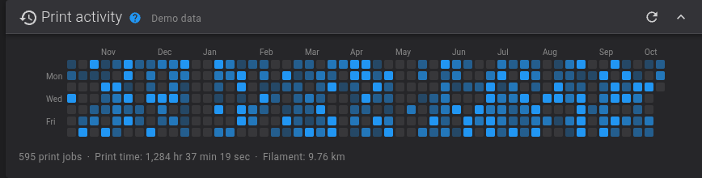

# Fluidd

## Print activity calendar prototype

This feature branch adds an optional dashboard calendar using Moonraker's print
history. Color intensity shows total print time for each day over the last
53 weeks.



_The screenshot uses synthetic demonstration data: 595 print jobs and
1,284 hours of print time across a year._

- Daily tooltips with job counts, print time, outcomes, and filament usage.
- A summary of activity for the displayed period.
- Collapse, visibility, and position controls in the dashboard layout editor.
- Theme and locale support, with no additional charting dependency.

The card is disabled by default. Open **Adjust Layout** on the dashboard, enable
**Print activity**, and place it in the desired column. Moonraker's `history`
component provides the data.

This branch is based on Fluidd's `develop`. A version of the widget has also been
tested on a real printer running Fluidd 1.37.6.

### Build this branch

Use the Node.js and pnpm versions specified in `package.json`, then run:

```bash
pnpm install --frozen-lockfile
pnpm run build
```

The generated `dist/` directory contains the web interface. See the
[development guide](docs/docs/development.md) for local development and
[printing documentation](docs/docs/features/printing.md#print-activity-calendar)
for the calendar's behavior.

---

Fluidd is a free and open-source Klipper web interface for managing your 3d printer.


## Features

- Responsive UI, supports desktop, tablets and mobile
- Customizable layouts. Move any panel where YOU want
- Built-in color themes
- Manage multiple printers from one Fluidd install
- [See our docs for more!](https://docs.fluidd.xyz)

## Support & Documentation

See our [Docs](https://docs.fluidd.xyz).
Join our [Discord!](https://discord.gg/GZ3D5tqfcF).

Want to help out? Read the [contributing guidelines](/CONTRIBUTING.md) and our [code of conduct](/.github/CODE_OF_CONDUCT.md).

Found a security issue? Please follow our [security policy](/.github/SECURITY.md).

## How to use?

Fluidd can be easily installed via [KIAUH](https://github.com/dw-0/kiauh), along with Klipper, Moonraker, and all of the required dependencies.

Please see the [docs](https://docs.fluidd.xyz) for help with installation and configuration.

## Where to download?

You can download the [latest release](https://github.com/fluidd-core/fluidd/releases/latest).

Browse the [release archive](https://github.com/fluidd-core/fluidd/releases) for older versions.

## Docker support

We have an [official docker image](https://github.com/fluidd-core/fluidd/pkgs/container/fluidd), serving Fluidd by default on port 80.

For those who have specific security requirements and need/want to run an unprivileged container, we also have an [unprivileged docker image](https://github.com/fluidd-core/fluidd/pkgs/container/fluidd-unprivileged) available, serving Fluidd by default on port 8080.

Both of these docker images are updated for each release and on each commit.

## Official sponsors

[](https://ldomotors.com/)

LDO, Excellence in Motion. LDO is an official sponsor of Fluidd.

## Supporting Fluidd

Fluidd development is driven by passionate volunteers who dedicate their time to improving and expanding its capabilities.

Your sponsorship can help us enhance Fluidd, introduce new features, and ensure it remains accessible to all Klipper users.

Your support can make a significant impact on the evolution of Fluidd. Please consider [sponsoring Fluidd](https://github.com/sponsors/fluidd-core).

## Credits

A big thank you to:

- the [Voron Community](http://vorondesign.com/)
- Kevin O'Connor for [Klipper](https://github.com/Klipper3d/klipper)
- Eric Callahan for [Moonraker](https://github.com/Arksine/moonraker)
- Dominik Willner for [KIAUH](https://github.com/dw-0/kiauh)
- Ray for [MainsailOS](https://github.com/raymondh2/MainsailOS)

## Misc

This project is tested with BrowserStack
